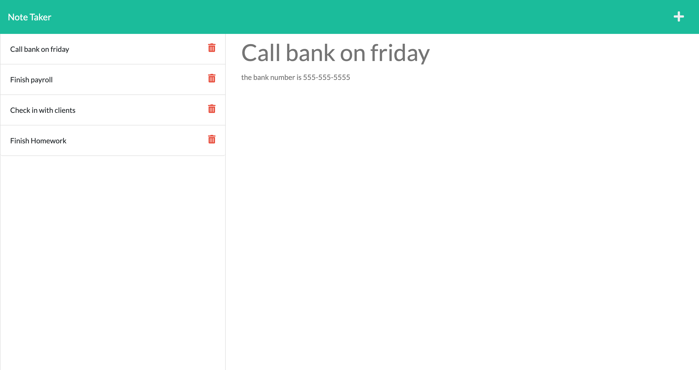

# Note Taker  

  <a href="https://opensource.org/licenses/MIT" alt="License">
        </a>
  
  ## Description
  An application that can be used to write and save notes. This application uses an Express.js back end and uses a JSON file to save and retrieve note data. 

  ## Table of Contents
  - [Installation](#installation)
  - [Usage](#usage)
  - [License](#license)
  - [Contributing](#Contributing)
  - [Tests](Test)
  - [Questions](Questions)

  ## Installation
  To install necessary dependencies, run the following command:
   ``` md
   npm i
   ```
  ## Usage
  
To view the deployed application, follow the [link](https://remembrance-minister-69880.herokuapp.com/)

- Follow the link on landing page to get to the notes page. 
- On the notes page, you'll see existing notes listed in the left-hand column plus empty fields to enter a new note title and the note’s text in the right-hand column. 
- After entering your note, a save icon appears in the navigation at the top of the page. 
- Click on the Save icon, and the new note is saved and appears in the left-hand column with the other existing notes. 
- You can click on an existing note in the list in the left-hand column and that note appears in the right-hand column. 
- Click on the write icon in the navigation at the top of the page to enter a new note.




  ## License
  This project is licensed under the [MIT](https://opensource.org/licenses/MIT) license.

  ## Contributing
  Please feel free to contact me! See my email and GitHub username below.

  ## Tests
  To run tests, run the following command:

  ``` md
  npm test
  ```
  ## Questions
  If you have any questions about the repo, open an issue or contact me directly at <sconwell.dev@gmail.com>. You can find more of my work at [shaneconwell](https://github.com/shaneconwell).

  